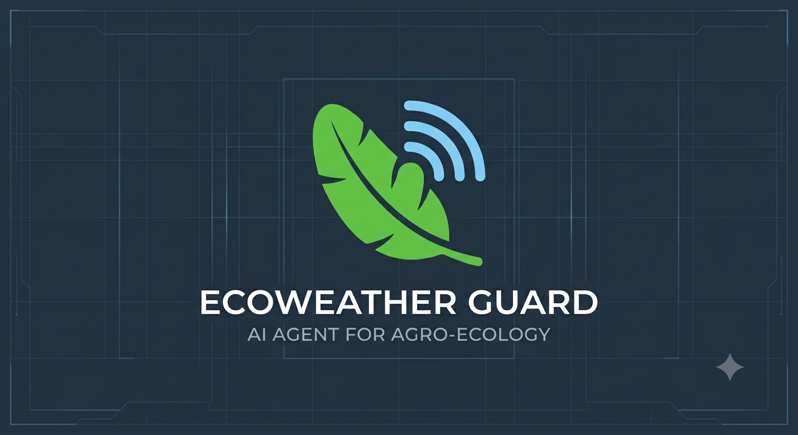
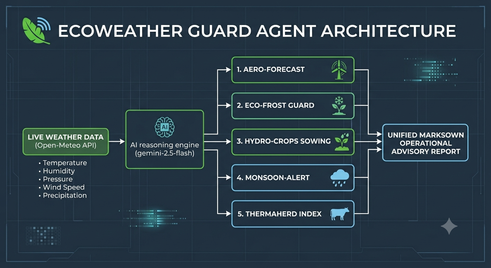

# 🌍 EcoWeather Guard Agent (Kaggle Capstone)

An elegant, lightweight, cloud-native expert system submitted under the **Agents for Good** track for the July 2026 Kaggle AI Agents Intensive.

## 📋 Overview
EcoWeather Guard bridges the gap between raw, complex atmospheric metrics and real-world agricultural safety. It queries real-time coordinate data and evaluates it across 5 specialized environmental dimensions simultaneously.

## 🛠️ Specialized Analytical Modules
1. **🌪️ AeroForecast:** Monitors surface pressure shifts to spot sudden micro-climate trends.
2. **❄️ EcoFrost Guard:** Evaluates temperature and humidity combinations to flag frost risks for sensitive indigenous crops.
3. **🌱 HydroCrops Sowing Window:** Analyzes immediate rain levels to map soil preparation windows.
4. **🚨 MonsoonAlert Risk Level:** Tracks localized rainfall load profiles to issue early community safety alerts.
5. **🐄 ThermaHerd Index (THI):** Dynamically calculates livestock heat stress to provide instant herd-welfare advisories.

## 💻 Tech Stack & Architecture
- **Orchestration:** Google GenAI SDK (`gemini-2.5-flash`)
- **Data Engine:** Open-Meteo REST API (Model Context Protocol tool pattern)
- **Environment:** Cloud Jupyter Notebook Container (Optimized for minimal local memory overhead)

## 🚀 Setup & Execution Instructions
1. Clone this repository.
2. Create a local `.env` file using the configuration keys shown in `.env.template`.
3. Execute `agent.py` or step through the provided Jupyter Notebook cells to stream real-time coordinate reports.

